# AI Therapist Application - Data Model & Entity Relationship Diagram

> **⚠️ IMPORTANT (2025-11-19)**: Legacy migration fields (`legacyId`) have been removed from all tables after database audit confirmed 0% legacy data usage. Historical references to `legacyId` in this document are kept for context but no longer apply to the current schema. See `convex/README-LEGACY.md` for details.

## Table of Contents

1. [Overview](#overview)
2. [Database Layer (Convex)](#database-layer-convex)
3. [Service/Domain Layer](#servicedomain-layer)
4. [UI/State Layer (Context + Query)](#uistate-layer-context--query)
5. [API Endpoints Reference](#api-endpoints-reference)
6. [Complete System Architecture](#complete-system-architecture)
7. [Data Flow Patterns](#data-flow-patterns)
8. [Type System Overview](#type-system-overview)
9. [Data Validation](#data-validation)
10. [Error Handling Patterns](#error-handling-patterns)

---

## Overview

The AI Therapist application implements a **three-layer data architecture**:

1. **Database Layer** - Persistent storage using Convex with real-time sync
2. **Service/Domain Layer** - Business logic, API contracts, and domain models
3. **UI/State Layer** - React Context, TanStack Query, and component-level state

This document provides a comprehensive map of all data structures, their relationships, and how data flows through the system.

---

## Database Layer (Convex)

### Entity Relationship Diagram

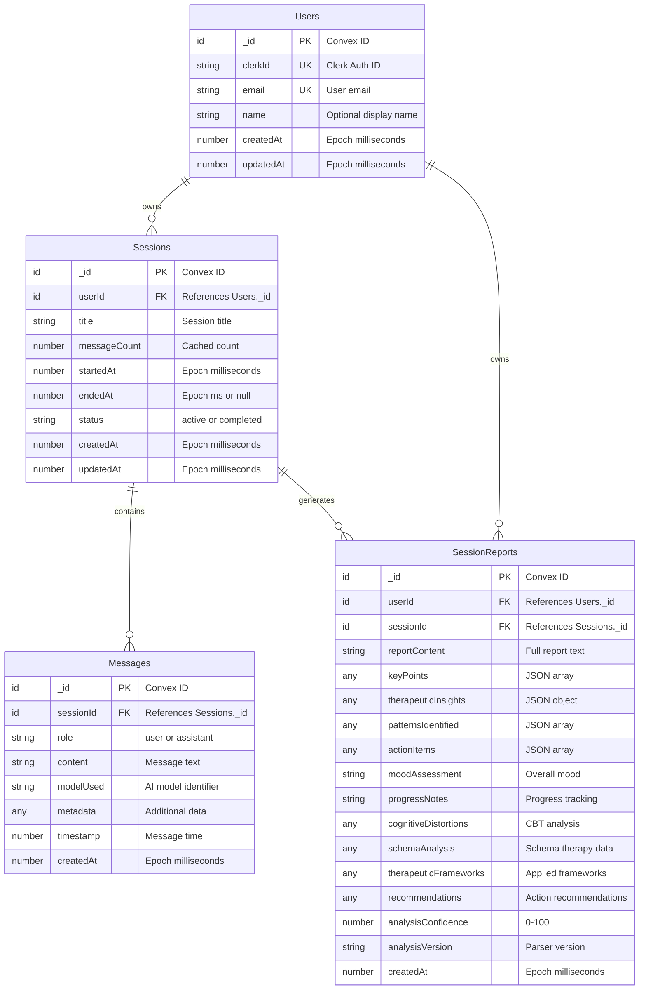

### Database Schema Details

#### Users Table

**Purpose**: Stores user authentication and profile information

| Column    | Type        | Constraints       | Description                        |
| --------- | ----------- | ----------------- | ---------------------------------- |
| \_id      | Id<'users'> | PRIMARY KEY       | Convex-generated unique identifier |
| clerkId   | string      | REQUIRED, INDEXED | Clerk authentication ID            |
| email     | string      | REQUIRED, INDEXED | User email address                 |
| name      | string?     | OPTIONAL          | Display name                       |
| createdAt | number      | REQUIRED          | Creation timestamp (epoch ms)      |
| updatedAt | number      | REQUIRED          | Last update timestamp (epoch ms)   |

**Indexes**:

- `email`: For email lookups
- `by_clerkId`: Primary authentication lookup

**Relationships**:

- 1:N with Sessions (one user owns many sessions)

---

#### Sessions Table

**Purpose**: Represents therapy conversation sessions

| Column       | Type           | Constraints | Description                          |
| ------------ | -------------- | ----------- | ------------------------------------ |
| \_id         | Id<'sessions'> | PRIMARY KEY | Convex-generated unique identifier   |
| userId       | Id<'users'>    | FOREIGN KEY | Owner of the session                 |
| title        | string         | REQUIRED    | Human-readable session title         |
| messageCount | number         | REQUIRED    | Cached message count for performance |
| startedAt    | number         | REQUIRED    | Session start time (epoch ms)        |
| endedAt      | number \| null | NULLABLE    | Session end time or null if active   |
| status       | string         | REQUIRED    | 'active' or 'completed'              |
| createdAt    | number         | REQUIRED    | Creation timestamp (epoch ms)        |
| updatedAt    | number         | REQUIRED    | Last update timestamp (epoch ms)     |

**Indexes**:

- `by_user_created`: Composite index on [userId, createdAt] for user session lists

**Relationships**:

- N:1 with Users (many sessions belong to one user)
- 1:N with Messages (one session contains many messages)
- 1:N with SessionReports (one session generates many reports)

**Business Rules**:

- messageCount is automatically incremented/decremented on message create/delete
- updatedAt is updated on any session activity
- status transitions: active → completed (one-way)

---

#### Messages Table

**Purpose**: Stores individual chat messages within sessions

| Column    | Type           | Constraints | Description                                  |
| --------- | -------------- | ----------- | -------------------------------------------- |
| \_id      | Id<'messages'> | PRIMARY KEY | Convex-generated unique identifier           |
| sessionId | Id<'sessions'> | FOREIGN KEY | Parent session                               |
| role      | string         | REQUIRED    | 'user' or 'assistant'                        |
| content   | string         | REQUIRED    | Message text content                         |
| modelUsed | string?        | OPTIONAL    | AI model identifier (for assistant messages) |
| metadata  | any?           | OPTIONAL    | Additional structured data                   |
| timestamp | number         | REQUIRED    | Message creation time (epoch ms)             |
| createdAt | number         | REQUIRED    | Database creation timestamp (epoch ms)       |

**Indexes**:

- `by_session_time`: Composite index on [sessionId, timestamp] for ordered message retrieval

**Relationships**:

- N:1 with Sessions (many messages belong to one session)

**Business Rules**:

- Messages are immutable after creation (except via explicit update mutation)
- Deleting a message decrements parent session's messageCount
- Messages are deleted when parent session is deleted (cascade)

---

#### SessionReports Table

**Purpose**: Stores AI-generated therapeutic analysis and insights

| Column                | Type                 | Constraints | Description                            |
| --------------------- | -------------------- | ----------- | -------------------------------------- |
| \_id                  | Id<'sessionReports'> | PRIMARY KEY | Convex-generated unique identifier     |
| userId                | Id<'users'>          | FOREIGN KEY | Owner of the report                    |
| sessionId             | Id<'sessions'>       | FOREIGN KEY | Associated session                     |
| reportContent         | string               | REQUIRED    | Full formatted report text             |
| keyPoints             | any                  | REQUIRED    | JSON array of key discussion points    |
| therapeuticInsights   | any                  | REQUIRED    | JSON object with therapeutic analysis  |
| patternsIdentified    | any                  | REQUIRED    | JSON array of behavioral patterns      |
| actionItems           | any                  | REQUIRED    | JSON array of recommended actions      |
| moodAssessment        | string?              | OPTIONAL    | Overall mood evaluation                |
| progressNotes         | string?              | OPTIONAL    | Progress tracking notes                |
| cognitiveDistortions  | any?                 | OPTIONAL    | CBT cognitive distortions analysis     |
| schemaAnalysis        | any?                 | OPTIONAL    | Schema therapy analysis                |
| therapeuticFrameworks | any?                 | OPTIONAL    | Applied therapeutic frameworks         |
| recommendations       | any?                 | OPTIONAL    | Structured recommendations             |
| analysisConfidence    | number?              | OPTIONAL    | Confidence score (0-100)               |
| analysisVersion       | string?              | OPTIONAL    | Parser/analyzer version                |
| createdAt             | number               | REQUIRED    | Report generation timestamp (epoch ms) |

**Indexes**:

- `by_session`: Index on [sessionId] for session report lookups
- `by_session_created`: Composite index on [sessionId, createdAt] for ordered session report reads
- `by_user_created`: Composite index on [userId, createdAt] for cross-session memory reads

**Relationships**:

- N:1 with Users (many reports belong to one user)
- N:1 with Sessions (many reports can be generated for one session)

**Business Rules**:

- Reports are immutable after generation
- Reports are deleted when parent session is deleted (cascade)
- Multiple reports per session support versioning/historical analysis

---

## Service/Domain Layer

### CBT Therapy Domain Model

The CBT (Cognitive Behavioral Therapy) domain is the core of the therapeutic functionality. It consists of **8 primary data concepts** with zero duplication.

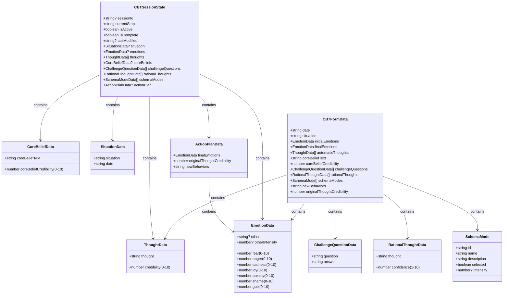

### CBT Data Types

#### 1. EmotionData

**Purpose**: Tracks emotional states on 0-10 intensity scale

```typescript
interface EmotionData {
  fear: number; // 0-10
  anger: number; // 0-10
  sadness: number; // 0-10
  joy: number; // 0-10
  anxiety: number; // 0-10
  shame: number; // 0-10
  guilt: number; // 0-10
  other?: string; // Custom emotion name
  otherIntensity?: number; // 0-10
}
```

**Usage**: Initial emotions, final emotions, emotion tracking throughout therapy

---

#### 2. ThoughtData

**Purpose**: Captures automatic thoughts with credibility ratings

```typescript
interface ThoughtData {
  thought: string; // The automatic thought
  credibility: number; // 0-10 credibility rating
}
```

**Usage**: Automatic thoughts identification step in CBT flow

---

#### 3. CoreBeliefData

**Purpose**: Represents underlying core beliefs

```typescript
interface CoreBeliefData {
  coreBeliefText: string; // The core belief statement
  coreBeliefCredibility: number; // 0-10 credibility rating
}
```

**Usage**: Core belief identification in CBT flow

---

#### 4. ChallengeQuestionData

**Purpose**: Cognitive restructuring challenge questions

```typescript
interface ChallengeQuestionData {
  question: string; // The challenge question
  answer: string; // User's answer
}
```

**Default Questions**:

1. What evidence supports this thought?
2. What evidence contradicts this thought?
3. What would I tell a friend in this situation?
4. How helpful is this thought?
5. What's the worst that could realistically happen?
6. What's a more balanced way to think about this?

---

#### 5. RationalThoughtData

**Purpose**: Alternative rational thoughts with confidence ratings

```typescript
interface RationalThoughtData {
  thought: string; // The rational alternative
  confidence: number; // 1-10 confidence rating
}
```

---

#### 6. SchemaMode

**Purpose**: Schema therapy mode identification

```typescript
interface SchemaMode {
  id: string; // Unique mode identifier
  name: string; // Mode name
  description: string; // Mode description
  selected: boolean; // Is this mode active?
  intensity?: number; // 0-10 intensity if selected
}
```

**Default Schema Modes** (based on Schema Therapy):

- Vulnerable Child: scared, helpless, needy
- Angry Child: frustrated, defiant, rebellious
- Punishing Parent: critical, harsh, demanding
- Demanding Parent: controlling, entitled, impatient
- Detached Self-Soother: withdrawn, disconnected, avoiding
- Healthy Adult: balanced, rational, caring

---

#### 7. SituationData

**Purpose**: Context for the therapeutic session

```typescript
interface SituationData {
  situation: string; // Description of the situation
  date: string; // Date of the situation
}
```

---

#### 8. ActionPlanData

**Purpose**: Final outcomes and behavioral changes

```typescript
interface ActionPlanData {
  finalEmotions: EmotionData; // Post-therapy emotions
  originalThoughtCredibility: number; // Updated credibility
  newBehaviors: string; // Planned behavioral changes
}
```

---

### CBT Flow State Machine

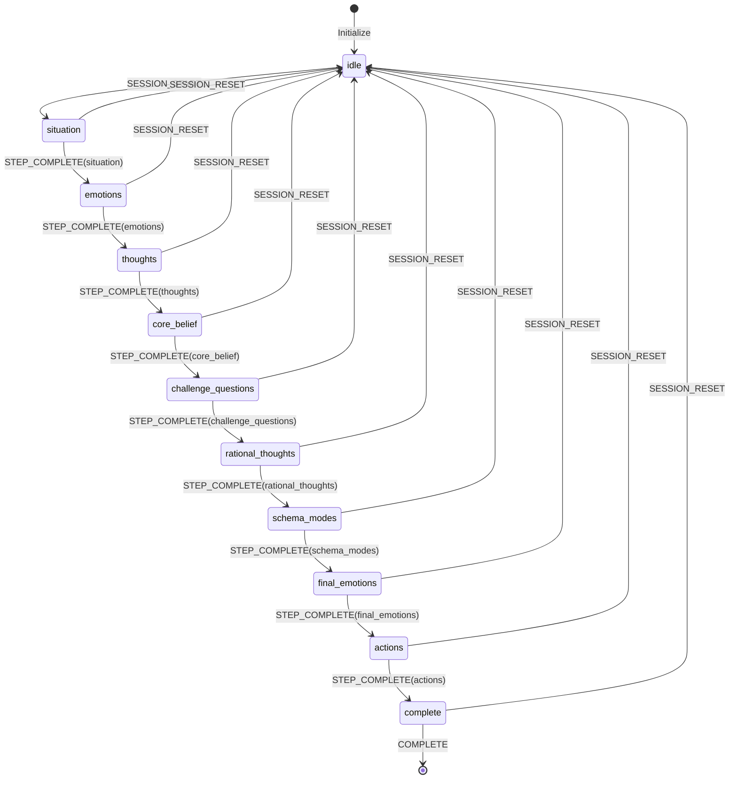

**CBT Flow Events**:

- `SESSION_START`: Begin new CBT session
- `STEP_COMPLETE`: Advance to next step with data
- `STEP_UPDATE`: Update current step data
- `SESSION_RESET`: Reset flow to idle
- `HYDRATE`: Restore from saved state

---

### CBT Draft Persistence

The CBT diary uses a **single source of truth** architecture with automatic localStorage persistence via the `usePersistedCBTFlow` hook.

**Location**: `src/features/therapy/cbt/hooks/use-persisted-cbt-flow.ts`

#### Exported Utilities (callable outside React)

```typescript
// Check if there's a persisted draft in localStorage
hasPersistedDraft(): boolean

// Get the last saved timestamp from persisted draft
getPersistedDraftTimestamp(): string | null

// Clear the persisted draft from localStorage
clearPersistedDraft(): void
```

#### Hook Options

```typescript
interface UsePersistedCBTFlowOptions {
  skipHydration?: boolean; // Skip loading from localStorage (for "Start Fresh")
  onChange?: (data: CBTSessionData) => Promise<void> | void;
}
```

#### When localStorage Draft is Cleared

| Scenario      | Trigger                                      |
| ------------- | -------------------------------------------- |
| Delete Draft  | User clicks trash icon                       |
| Start Fresh   | User clicks "Start New" (skipHydration=true) |
| Send to Chat  | Successful send completes                    |
| Flow Complete | User completes final step                    |
| Hook Reset    | `reset()` called                             |

---

### Obsessions & Compulsions Domain Model

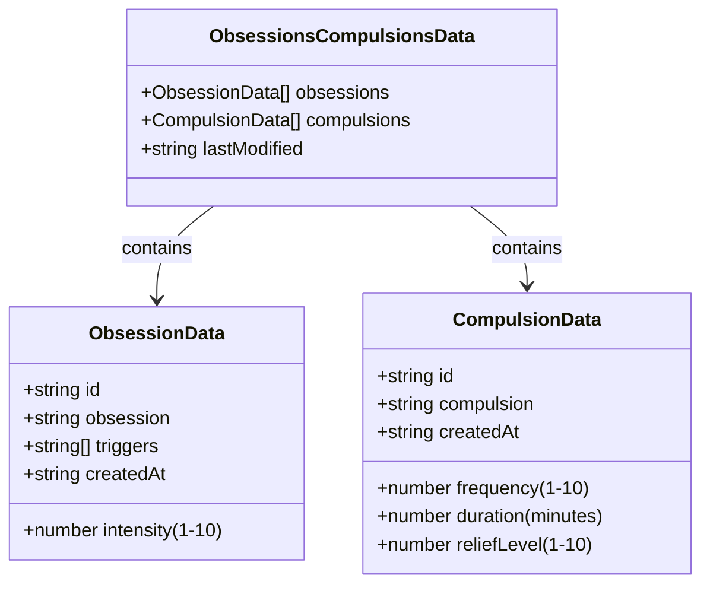

---

### API Models (OpenAPI Schema)

The API layer uses auto-generated TypeScript types from `docs/api.yaml`.

#### Key API Types

```typescript
// Auto-generated from OpenAPI spec
interface Message {
  id?: string; // UUID
  role: 'user' | 'assistant';
  content: string;
  timestamp?: string; // ISO 8601
  createdAt?: string; // ISO 8601
}

interface Session {
  id: string; // UUID
  userId: string;
  title: string;
  status: 'active' | 'completed';
  startedAt?: string; // ISO 8601
  endedAt?: string | null;
  createdAt?: string; // ISO 8601
  updatedAt?: string; // ISO 8601
  _count?: {
    messages?: number;
  };
}

interface SessionReport {
  id: string; // Convex document ID
  sessionId: string; // Convex session document ID
  keyPoints?: string; // JSON string
  therapeuticInsights: string;
  patternsIdentified?: string; // JSON string
  actionItems?: string; // JSON string
  moodAssessment?: string | null;
  progressNotes?: string | null;
  createdAt?: string; // ISO 8601
}

interface ModelConfig {
  id: string; // e.g., "openai/gpt-oss-120b"
  name: string; // Human-readable name
  provider: string; // Provider name
  maxTokens: number; // Token limit
  category: 'featured' | 'production' | 'preview';
}

interface ChatRequest {
  messages: Array<{ role: 'user' | 'assistant'; content: string }>;
  sessionId?: string;
  model?: string;
  apiKey?: string;
  temperature?: number; // 0-2
  maxTokens?: number; // 256-131072
  topP?: number; // 0.1-1.0
}
```

---

## UI/State Layer (Context + Query)

### Context and Query Architecture

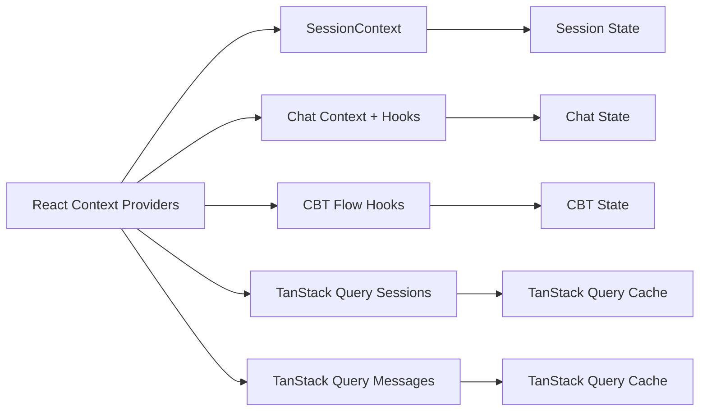

### Session Context State

```typescript
interface SessionsState {
  currentSessionId: string | null; // Active session ID
  isCreatingSession: boolean; // Loading state
  isDeletingSession: string | null; // Session being deleted
  error: string | null; // Error message
}
```

**Actions**:

- `deleteSession(sessionId)`: Mark session for deletion
- `setCurrentSession(sessionId)`: Set active session
- `setCreatingSession(isCreating)`: Update creation state
- `setDeletingSession(sessionId)`: Update deletion state
- `setError(message)`: Set error message

---

### Chat UI State

```typescript
interface ChatState {
  isStreaming: boolean; // Is response streaming?
  currentInput: string; // Current user input
  streamingMessageId: string | null; // ID of streaming message
  error: string | null; // Error message
  settings: {
    model: string; // Selected AI model
    webSearchEnabled: boolean; // Web search toggle
  };
}
```

**Actions**:

- `setStreaming({ isStreaming, messageId })`: Update streaming state
- `setCurrentInput(input)`: Update input field
- `clearMessages()`: Reset chat state
- `setError(message)`: Set error message
- `updateSettings(settings)`: Update chat settings

---

### CBT Flow State

```typescript
interface CBTState {
  currentDraft: CBTDraft | null; // Active CBT draft
  savedDrafts: CBTDraft[]; // Saved drafts
  completedEntries: CBTFormData[]; // Completed entries
  currentStep: number; // Current step (1-10)
  isSubmitting: boolean; // Submission state
  validationErrors: Record<string, string>; // Field errors
  lastAutoSave: string | null; // Last auto-save time
  flow: CBTFlowState; // Flow state machine
}

interface CBTDraft {
  id: string;
  data: Partial<CBTFormData>;
  currentStep: number;
  lastSaved: string;
  isComplete: boolean;
}
```

**Actions**:

- `createDraft({ id })`: Create new draft
- `updateDraft(data)`: Update draft data
- `setCurrentStep(step)`: Navigate to step
- `saveDraft()`: Save current draft
- `loadDraft(id)`: Load saved draft
- `deleteDraft(id)`: Delete draft
- `completeCBTEntry(data)`: Mark entry complete
- `startCBTSession({ sessionId })`: Start CBT flow
- `applyCBTEvent(event)`: Apply flow event
- `hydrateCBTSession(state)`: Restore flow state
- `clearCBTSession()`: Reset CBT state

---

## Service/Domain Layer Classes

### Service Architecture

The service layer implements business logic and orchestrates data operations between API routes and Convex:

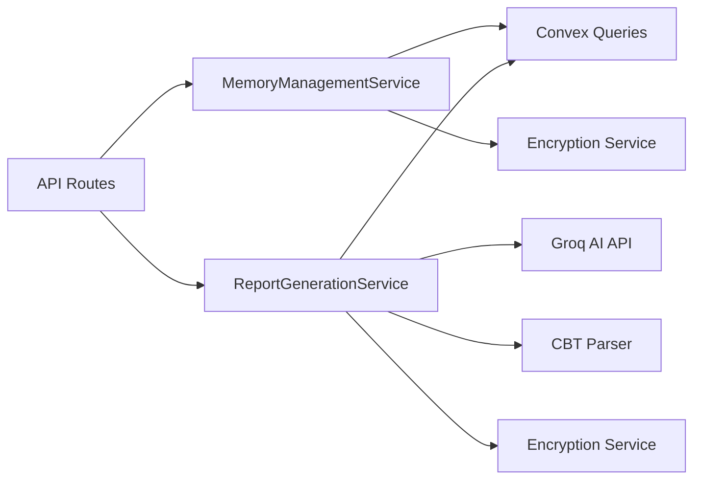

### MemoryManagementService

**Purpose**: Manages therapeutic memory context across sessions for continuity

**Location**: `src/lib/services/memory-management-service.ts`

**Methods**:

| Method                | Parameters                                             | Returns            | Description                                      |
| --------------------- | ------------------------------------------------------ | ------------------ | ------------------------------------------------ |
| `getMemoryContext`    | `clerkId, limit, excludeSessionId`                     | `MemoryData`       | Retrieve recent session reports for chat context |
| `getMemoryManagement` | `clerkId, limit, excludeSessionId, includeFullContent` | `MemoryManageData` | Get detailed management view with full reports   |
| `deleteMemory`        | `clerkId, sessionIds?, limit?, excludeSessionId?`      | `DeleteMemoryData` | Delete memory records (specific, recent, or all) |

**Key Features**:

- **User Filtering**: Automatically resolves clerkId → Convex userId
- **Report Decryption**: Decrypts encrypted session reports
- **Therapeutic Summaries**: Creates concise summaries from structured CBT data
- **Error Resilience**: Gracefully handles decryption failures
- **Statistics Tracking**: Returns success/failure counts

**Memory Data Types**:

```typescript
interface MemoryContextEntry {
  sessionTitle: string;
  sessionDate: string;
  reportDate: string;
  content: string; // Full decrypted content
  summary: string; // Therapeutic summary
}

interface MemoryData {
  memoryContext: MemoryContextEntry[];
  reportCount: number;
  stats: {
    totalReportsFound: number;
    successfullyDecrypted: number;
    failedDecryptions: number;
  };
}
```

**Usage Pattern**:

```typescript
const service = new MemoryManagementService();
const memory = await service.getMemoryContext('clerk_user_123', 5, 'current-session-id');
// Returns last 5 sessions' reports (excluding current) for this user
```

---

### ReportGenerationService

**Purpose**: Generates AI-powered therapeutic insights and session reports

**Location**: `src/lib/services/report-generation-service.ts`

**Methods**:

| Method           | Parameters           | Returns         | Description                             |
| ---------------- | -------------------- | --------------- | --------------------------------------- |
| `generateReport` | `sessionId, clerkId` | `SessionReport` | Generate comprehensive session analysis |

**Generation Process**:

1. **Fetch Session Data**: Retrieve all messages from Convex
2. **Parse CBT Data**: Extract structured CBT information from conversation
3. **AI Analysis**: Generate therapeutic insights with the configured analytical model
4. **Structure Extraction**: Parse AI response into components
5. **Encryption**: Encrypt sensitive report content
6. **Persistence**: Save to Convex sessionReports table

**Report Components**:

```typescript
interface SessionReport {
  reportContent: string; // Full formatted report
  keyPoints: string[]; // Main discussion topics
  therapeuticInsights: {
    // AI analysis
    primaryInsights: string[];
    growthAreas: string[];
  };
  patternsIdentified: string[]; // Behavioral patterns
  actionItems: string[]; // Recommendations
  moodAssessment?: string; // Overall mood
  progressNotes?: string; // Progress tracking
  cognitiveDistortions?: unknown; // CBT analysis
  schemaAnalysis?: unknown; // Schema therapy
  analysisConfidence?: number; // 0-100 confidence score
  analysisVersion?: string; // Parser version
}
```

**AI Model Policy**: analytical model is sourced from `MODEL_IDS.analytical` (currently `openai/gpt-oss-120b`). If a BYOK key is present, BYOK model selection takes precedence over explicit model overrides.

---

## API Endpoints Reference

### Authentication & Sessions

| Endpoint                                | Method | Auth     | Description                                                  | Middleware                |
| --------------------------------------- | ------ | -------- | ------------------------------------------------------------ | ------------------------- |
| `/api/sessions`                         | GET    | Required | List user sessions with pagination                           | `withAuth`                |
| `/api/sessions`                         | POST   | Required | Create new therapy session                                   | `withAuth`                |
| `/api/sessions/current`                 | GET    | Required | Get currently active session                                 | `withAuth`                |
| `/api/sessions/current`                 | POST   | Required | Update current-session pointer only (does not change status) | `withValidation`          |
| `/api/sessions/:id`                     | GET    | Required | Get session with messages & reports                          | `withAuth`                |
| `/api/sessions/:id`                     | PATCH  | Required | Update session title/status                                  | `withValidationAndParams` |
| `/api/sessions/:id`                     | DELETE | Required | Delete session and all messages                              | `withAuth`                |
| `/api/sessions/:id/resume`              | POST   | Required | Explicitly resume a session lifecycle to `active`            | `withAuth`                |
| `/api/sessions/:id/messages`            | GET    | Required | List messages in session                                     | `withAuth`                |
| `/api/sessions/:id/messages/:messageId` | DELETE | Required | Delete specific message                                      | `withAuth`                |

### Chat & AI

| Endpoint      | Method | Auth     | Description                                 | Middleware                      |
| ------------- | ------ | -------- | ------------------------------------------- | ------------------------------- |
| `/api/chat`   | POST   | Required | Send message, receive streaming AI response | `withAuthAndRateLimitStreaming` |
| `/api/models` | GET    | None     | List available AI models                    | `withApiMiddleware`             |

**Chat Rate Limiting**: 15 requests per minute, max 3 concurrent streams

**Request Format**:

```typescript
{
  message: string;           // User message (trimmed, non-empty)
  sessionId?: string;        // Optional session context
  selectedModel?: string;    // Optional model override
  webSearchEnabled?: boolean; // Enable web search tools
}
```

**Validation**:

- Content-Type must be `application/json` (returns 415 if not)
- Message trimmed and validated (whitespace-only rejected with 400)
- Max body size: 50MB (returns 413 if exceeded)

### Reports & Memory

| Endpoint                        | Method | Auth     | Description                                                    | Middleware |
| ------------------------------- | ------ | -------- | -------------------------------------------------------------- | ---------- |
| `/api/reports`                  | GET    | Required | List session reports for user                                  | `withAuth` |
| `/api/reports/generate`         | POST   | Required | Generate AI-powered session report from persisted session data | `withAuth` |
| `/api/reports/generate-context` | POST   | Required | Generate report from caller-provided contextual message set    | `withAuth` |
| `/api/reports/memory`           | GET    | Required | Get memory context for continuity                              | `withAuth` |
| `/api/reports/memory`           | DELETE | Required | Clear memory (specific/recent/all)                             | `withAuth` |

Report generation model selection uses analytical default unless overridden with a valid model; BYOK keys override both and force the BYOK model path.

**Memory Query Parameters**:

- `limit` - Number of reports (default: 5, max: 10)
- `excludeSessionId` - Exclude specific session
- `manage=true` - Get detailed management view
- `includeFullContent=true` - Include full decrypted content

### System & Diagnostics

| Endpoint            | Method | Auth | Description                 | Middleware          |
| ------------------- | ------ | ---- | --------------------------- | ------------------- |
| `/api/health`       | GET    | None | Application health check    | `withApiMiddleware` |
| `/api/health/cache` | GET    | None | Cache system health         | `withApiMiddleware` |
| `/api/metrics`      | GET    | None | System metrics (if enabled) | `withApiMiddleware` |
| `/api/env`          | GET    | None | Environment configuration   | `withApiMiddleware` |
| `/api/errors`       | POST   | None | Client-side error reporting | `withApiMiddleware` |

### Middleware Types Reference

| Middleware                      | Auth | Rate Limit | Use Case                           |
| ------------------------------- | ---- | ---------- | ---------------------------------- |
| `withApiMiddleware`             | No   | No         | Public endpoints                   |
| `withAuth`                      | Yes  | No         | Authenticated endpoints            |
| `withAuthAndRateLimit`          | Yes  | Yes        | Protected endpoints with limits    |
| `withAuthStreaming`             | Yes  | No         | Streaming responses                |
| `withAuthAndRateLimitStreaming` | Yes  | Yes        | Chat endpoint (streaming + limits) |
| `withValidation`                | Yes  | No         | Zod schema validation              |
| `withValidationAndParams`       | Yes  | No         | Validation + route params          |

---

## Complete System Architecture

```mermaid
graph TB
    subgraph "Client Layer"
        UI[React Components]
        Store[Context Providers]
        Hooks[Custom Hooks]
    end

    subgraph "API Layer"
        ChatAPI[/api/chat]
        SessionsAPI[/api/sessions]
        MessagesAPI[/api/sessions/:id/messages]
        ReportsAPI[/api/reports]
        ModelsAPI[/api/models]
        MemoryAPI[/api/reports/memory]
    end

    subgraph "Service Layer"
        ChatService[Chat Service]
        SessionService[Session Service]
        ReportService[Report Service]
        CBTParser[CBT Data Parser]
        TherapyPrompts[Therapy Prompts]
        Encryption[Message Encryption]
    end

    subgraph "Data Layer"
        Convex[(Convex Database)]
        Cache[In-Memory Cache]
    end

    subgraph "External Services"
        Clerk[Clerk Auth]
        Groq[Groq AI API]
    end

    UI --> Store
    UI --> Hooks
    Hooks --> Store
    Store --> ChatAPI
    Store --> SessionsAPI
    Store --> MessagesAPI
    Store --> ReportsAPI
    Store --> ModelsAPI

    ChatAPI --> ChatService
    SessionsAPI --> SessionService
    MessagesAPI --> SessionService
    ReportsAPI --> ReportService

    ChatService --> Groq
    ChatService --> CBTParser
    ChatService --> TherapyPrompts
    ChatService --> Encryption

    SessionService --> Convex
    ReportService --> Convex

    ChatAPI --> Cache
    SessionsAPI --> Cache

    AuthAPI --> Clerk
    SessionService --> Cache

    Convex --> Users[users table]
    Convex --> Sessions[sessions table]
    Convex --> Messages[messages table]
    Convex --> Reports[sessionReports table]
```

---

## Data Flow Patterns

### 1. Chat Message Flow

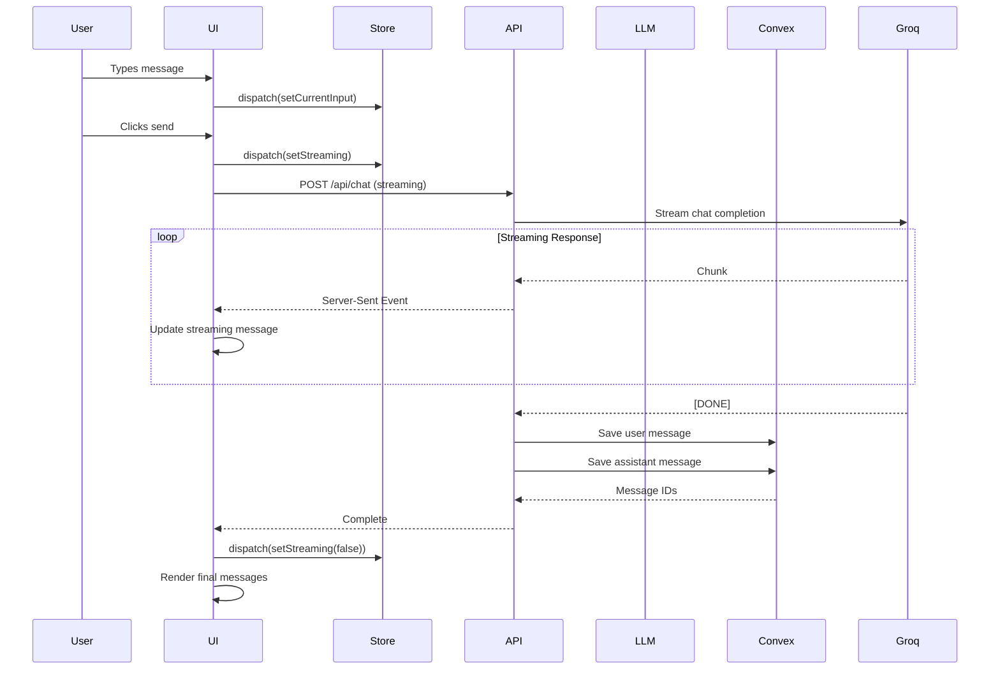

**Key Steps**:

1. User input captured in React state and feature hooks
2. Streaming request initiated to `/api/chat`
3. Groq AI streams response chunks
4. UI updates in real-time via SSE
5. Messages saved to Convex after completion
6. Session messageCount incremented

---

### 2. CBT Therapy Flow

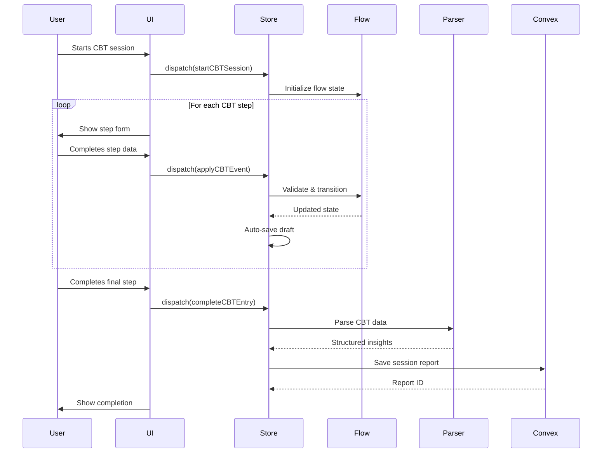

**CBT Flow Steps** (10 total):

1. **Situation**: Context and date
2. **Initial Emotions**: Emotional baseline
3. **Automatic Thoughts**: Negative thoughts
4. **Core Beliefs**: Underlying beliefs
5. **Challenge Questions**: Cognitive restructuring
6. **Rational Thoughts**: Alternative perspectives
7. **Schema Modes**: Active schema modes
8. **Final Emotions**: Post-therapy emotions
9. **Action Plan**: Behavioral changes
10. **Complete**: Session summary

**Auto-save**: Drafts saved to `localStorage` every step change

---

### 3. Session Management Flow

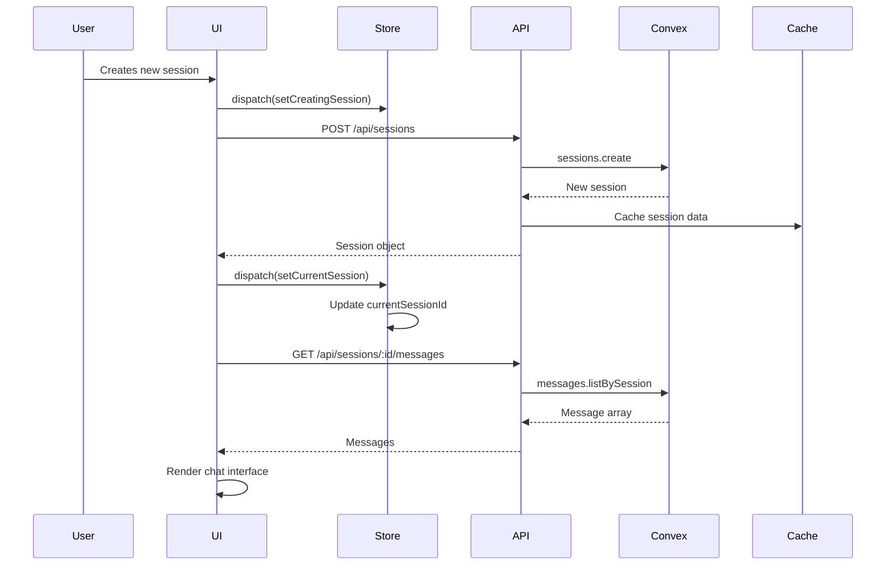

**Caching Strategy**:

- Sessions cached in-memory (5 min TTL)
- Messages cached per session (3 min TTL)
- Cache invalidated on mutations

---

### 4. Report Generation Flow

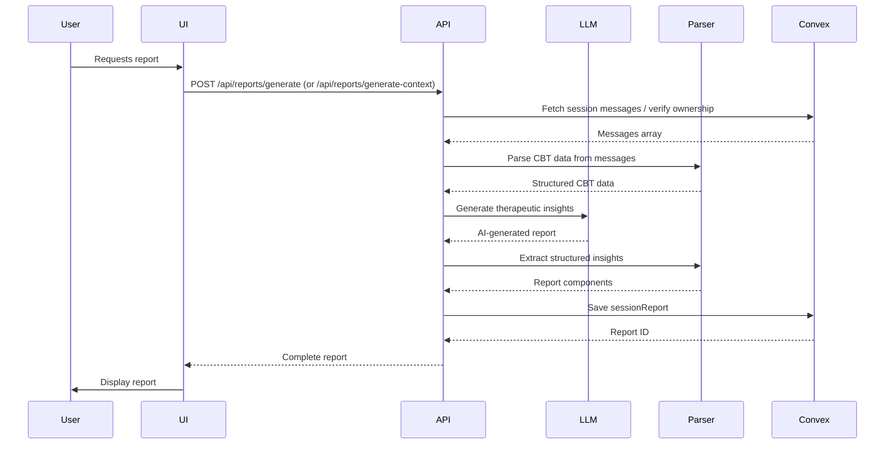

**Report Components**:

- Key Points: Main discussion topics
- Therapeutic Insights: AI analysis
- Patterns Identified: Behavioral patterns
- Action Items: Recommendations
- Mood Assessment: Overall mood evaluation
- CBT Data: Structured CBT analysis

---

### 5. Authentication Flow

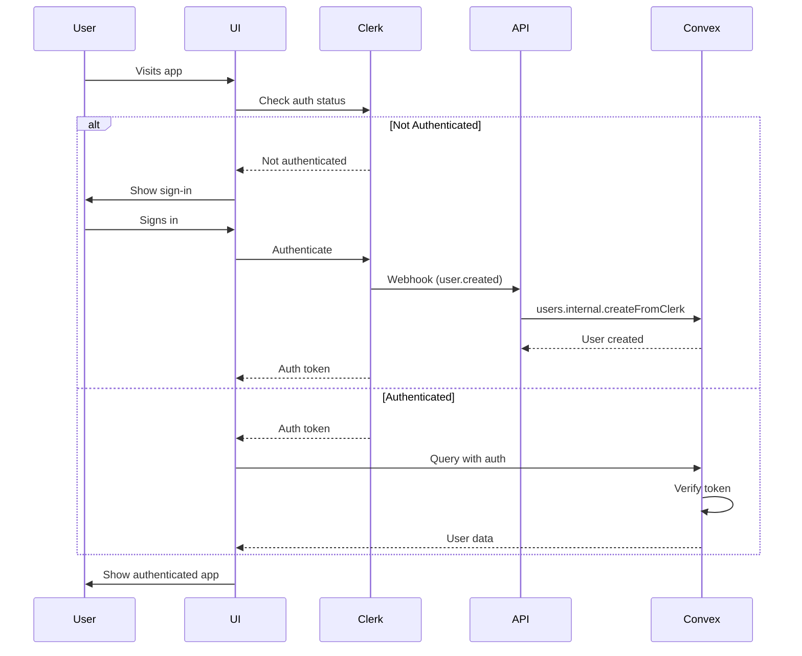

**Security Features**:

- Clerk handles authentication
- Convex validates JWT tokens
- Session cookies secured (HttpOnly, Secure, SameSite)
- TOTP-based device verification
- Encrypted message storage

### User Data Isolation

All data queries implement user-level isolation to ensure users only access their own therapeutic data:

**Convex Queries** (Database Layer):

```typescript
// All queries now filter by userId
reports.listRecent({ userId, limit, excludeSessionId }); // User's reports only
sessions.listByUserPaginated({ userId, numItems, cursor }); // User's sessions only
messages.listBySession({ sessionId }); // Verified session ownership
```

**Service Layer**:

```typescript
// Services accept clerkId and resolve to Convex userId
MemoryManagementService.getMemoryContext(clerkId, limit, excludeSessionId);
MemoryManagementService.getMemoryManagement(clerkId, limit, excludeSessionId, includeFullContent);
MemoryManagementService.deleteMemory(clerkId, sessionIds, limit, excludeSessionId);
```

**Implementation Pattern**:

1. API route receives authenticated request via `withAuth` middleware
2. Extract canonical identity from `context.principal.clerkId`
3. Pass `clerkId` to service layer
4. Service resolves Clerk ID to Convex user ID via `users.getByClerkId`
5. Query Convex with resolved `userId` for data isolation

**Middleware**:

- `withAuth` - Automatically validates auth and populates `context.principal` with canonical identity
- `withApiMiddleware` - No auth validation (use for public endpoints only)

**Example Flow**:

```typescript
// API Route
export const GET = withAuth(async (request, context) => {
  const clerkId = context.principal.clerkId;
  const data = await service.getData(clerkId);
  return createSuccessResponse(data);
});

// Service Layer
async getData(clerkId: string) {
  const user = await convex.query(anyApi.users.getByClerkId, { clerkId });
  if (!user) throw new Error('User not found');

  const data = await convex.query(anyApi.data.listByUser, { userId: user._id });
  return data;
}
```

This multi-layer approach ensures:

- ✅ Complete data isolation between users
- ✅ No unauthorized access to other users' therapeutic data
- ✅ Consistent security model across all endpoints

---

## Type System Overview

### Type File Organization

```
src/types/
├── index.ts                    # Central exports
├── database.ts                 # Convex type wrappers
├── therapy.ts                  # CBT domain types
├── chat.ts                     # Chat component types
├── auth.ts                     # Authentication types
├── ui.ts                       # UI component types
├── api.generated.ts            # OpenAPI generated types
├── convex.ts                   # Convex client types
├── report.ts                   # Report types
└── api/
    ├── sessions.ts             # Session API types
    ├── messages.ts             # Message API types
    ├── chat.ts                 # Chat API types
    ├── reports.ts              # Report API types
    └── models.ts               # Model API types
```

### Type Dependencies

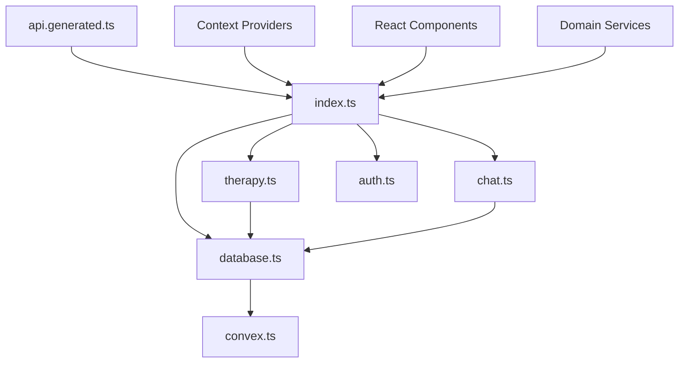

### Key Type Exports

**Database Types** (`database.ts`):

```typescript
export type UserDoc = Doc<'users'>;
export type SessionDoc = Doc<'sessions'>;
export type MessageDoc = Doc<'messages'>;
export type SessionReportDoc = Doc<'sessionReports'>;
export type SessionId = Id<'sessions'>;
export type UserId = Id<'users'>;
```

**Therapy Types** (`therapy.ts`):

```typescript
export interface EmotionData { ... }
export interface ThoughtData { ... }
export interface CoreBeliefData { ... }
export interface ChallengeQuestionData { ... }
export interface RationalThoughtData { ... }
export interface SchemaMode { ... }
export interface SituationData { ... }
export interface ActionPlanData { ... }
export interface CBTFormData { ... }
export interface CBTSessionState { ... }
```

**API Types** (`api.generated.ts`):

- Auto-generated from `docs/api.yaml` via `openapi-typescript`
- Run `npm run api:types` to regenerate
- Provides type-safe API contracts

---

## Data Validation

### Validation Layers

1. **Client-Side Validation** (Zod schemas)
   - Form validation in UI
   - Type-safe form data
   - Real-time error feedback

2. **API Validation** (Zod schemas)
   - Request body validation
   - Query parameter validation
   - Response validation

3. **Database Validation** (Convex validators)
   - Type validation via `v.*` validators
   - Index validation
   - Referential integrity

### Example Validation Flow

```typescript
// 1. Client-side (React Hook Form + Zod)
const formSchema = z.object({
  title: z.string().min(1).max(200),
  status: z.enum(['active', 'completed']),
});

// 2. API validation
const requestSchema = z.object({
  sessionId: z.string().uuid(),
  title: z.string().min(1).max(200),
});

// 3. Convex mutation validation
export const update = mutation({
  args: {
    sessionId: v.id('sessions'),
    title: v.optional(v.string()),
    status: v.optional(v.string()),
  },
  handler: async (ctx, args) => { ... }
});
```

### Input Validation Rules

**Chat Messages** (`src/lib/chat/chat-request.ts`):

- Message content **trimmed** before validation via `.transform(val => val.trim())`
- Empty or whitespace-only messages **rejected** with clear error
- Minimum 1 character after trimming
- Error message: "Message cannot be empty or contain only whitespace"
- Schema: `z.string().min(1).transform(val => val.trim()).refine(val => val.length > 0)`

**Session IDs** (`src/lib/repositories/session-repository.ts`):

- Validated before Convex queries to prevent crashes
- Invalid format caught and returns `null` → API returns 404
- Prevents 500 errors from Convex ID validation failures
- Applied in: `getSessionWithMessages()`, `verifySessionOwnership()`

**Content-Type Headers** (`src/app/api/chat/route.ts`):

- Chat endpoint **requires** `application/json` Content-Type
- Returns **415 Unsupported Media Type** for other types
- Validates before parsing request body
- Protects against malformed requests

**Request Body Size**:

- Chat messages: Max 50MB (returns 413 if exceeded)
- Configurable via `CHAT_INPUT_MAX_BYTES` environment variable

---

## Performance Considerations

### Caching Strategy

| Data Type       | Cache Location  | TTL          | Invalidation             |
| --------------- | --------------- | ------------ | ------------------------ |
| Sessions        | In-memory cache | 5 min        | On session mutation      |
| Messages        | In-memory cache | 3 min        | On message create/delete |
| Session Reports | In-memory cache | 10 min       | On report generation     |
| User Profile    | Context state   | Session      | On auth change           |
| CBT Drafts      | localStorage    | Persistent   | On completion/deletion   |
| AI Models       | Memory          | App lifetime | None                     |

### Query Optimization

1. **Indexed Queries**:
   - All Convex queries use appropriate indexes
   - Composite indexes for multi-field queries
   - Order by optimization

2. **Pagination**:
   - Messages paginated (50 per page, max 200)
   - Sessions paginated (50 per page, max 100)
   - Cursor-based pagination for large lists

3. **Lazy Loading**:
   - Messages loaded on demand per session
   - Reports loaded separately from sessions
   - AI models fetched once on app load

4. **Real-time Updates**:
   - Convex subscriptions for live data
   - Automatic UI updates on data changes
   - Optimistic updates for mutations

---

## Migration & Legacy Support

### Legacy ID Fields

**Note**: As of 2025-11-19, legacy migration fields (`legacyId`) have been removed from the schema after confirming no legacy data exists in the database. For historical reference, see `convex/README-LEGACY.md`.

**Migration Pattern**:

1. Import data with legacy IDs
2. Create new Convex records
3. Map legacy IDs to new IDs
4. Update references
5. Maintain legacy ID lookups during transition

### Version Tracking

**SessionReports** include version tracking:

```typescript
interface SessionReportDoc {
  analysisVersion?: string; // e.g., "v2.3.0"
  analysisConfidence?: number; // 0-100
}
```

This enables:

- A/B testing of analysis algorithms
- Rollback to previous versions
- Comparison of analysis quality over time

---

## Error Handling Patterns

### HTTP Status Code Strategy

The application follows REST conventions with specific status codes for each error type:

| Status | Use Case               | Example                                          |
| ------ | ---------------------- | ------------------------------------------------ |
| 200    | Success                | Data retrieved, operation completed              |
| 400    | Bad Request            | Invalid input, validation failure, empty message |
| 401    | Unauthorized           | Missing or invalid authentication token          |
| 403    | Forbidden              | Authenticated but not authorized for resource    |
| 404    | Not Found              | Resource doesn't exist or not owned by user      |
| 413    | Payload Too Large      | Request body exceeds size limit                  |
| 415    | Unsupported Media Type | Wrong Content-Type header                        |
| 429    | Too Many Requests      | Rate limit exceeded                              |
| 500    | Internal Server Error  | Unexpected server errors                         |

### Error Response Format

All API endpoints return standardized error responses:

```typescript
{
  success: false,
  error: string,              // Human-readable error message
  code?: string,              // Machine-readable error code
  requestId: string,          // Unique request identifier for debugging
  details?: Record<string, unknown> // Additional context
}
```

**Example Error Response**:

```json
{
  "success": false,
  "error": "Message cannot be empty or contain only whitespace",
  "code": "VALIDATION_ERROR",
  "requestId": "req_abc123",
  "details": {
    "field": "message",
    "received": "   \\n\\t   "
  }
}
```

### Error Handling Strategy

**1. Validation Errors → 400**

- Empty or whitespace-only messages
- Invalid field formats
- Missing required fields
- Returns specific field errors in details

**2. Authentication Errors → 401**

- Missing Clerk authentication token
- Invalid or expired token
- No valid user session

**3. Authorization Errors → 403**

- Authenticated but accessing another user's data
- Resource ownership violation

**4. Not Found → 404**

- Resource doesn't exist in database
- Invalid session/message/report ID format
- Session not owned by authenticated user
- **Important**: Invalid IDs return 404, not 500

**5. Content Type Errors → 415**

- Wrong Content-Type header on /api/chat
- Must be `application/json`

**6. Rate Limit → 429**

- Too many requests in time window
- Includes `Retry-After` header

**7. Server Errors → 500**

- Unexpected exceptions
- Database connection failures
- Always includes requestId for debugging
- Logged with full stack trace

### Error Handling Implementation

**Invalid ID Pattern** (prevents 500 errors):

```typescript
try {
  const session = await getSession(sessionId);
  if (!session) {
    return createNotFoundErrorResponse('Session', requestId);
  }
} catch (error) {
  // Catch Convex ID validation errors
  if (error instanceof Error && error.message.includes('Invalid ID')) {
    return createErrorResponse('Invalid session ID format', 404, { requestId });
  }
  throw error; // Re-throw unexpected errors
}
```

**Graceful Degradation**:

- Failed report decryption → Skip report, continue with others
- Missing user → Return empty data, not 500
- Cache unavailable → Fall back to database

---

## Summary

This data model provides:

✅ **Separation of Concerns**: Clear boundaries between database, service, and UI layers  
✅ **Type Safety**: Comprehensive TypeScript types throughout  
✅ **Scalability**: Indexed queries, pagination, caching  
✅ **Real-time**: Convex subscriptions for live updates  
✅ **Flexibility**: Support for legacy data, versioning, extensions  
✅ **Security**: Encrypted messages, authenticated access, validated inputs  
✅ **Developer Experience**: Auto-generated types, clear contracts, comprehensive documentation

For implementation details, refer to:

- Database: `convex/schema.ts` and `convex/*.ts`
- Types: `src/types/*.ts`
- API: `docs/api.yaml` and `src/app/api/*/route.ts`
- State: `src/store/slices/*.ts`
