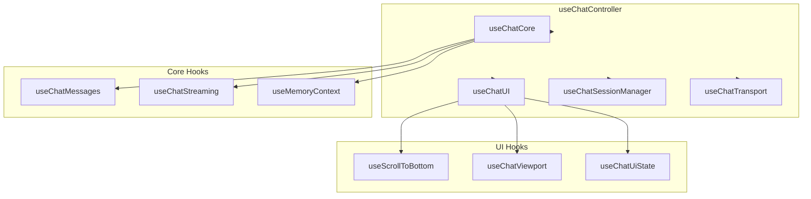

# Component Hierarchy

This document describes the React component structure of the AI Therapist application.

## Page Component Tree

```mermaid
flowchart TD
    subgraph Root["Root Layout"]
        HTML["html"]
        Body["body"]
        Providers["Providers"]
    end

    subgraph Providers["Provider Stack"]
        ClerkP["ClerkProvider"]
        QueryP["QueryClientProvider"]
        ThemeP["ThemeProvider"]
        ToastP["Toaster"]
    end

    subgraph Pages["Page Routes"]
        Home["/ (Home)"]
        Dashboard["/(protected)/dashboard"]
        Chat["/(protected)/chat"]
        Settings["/(protected)/settings"]
    end

    subgraph ChatPage["Chat Page Structure"]
        ChatLayout["ChatLayout"]
        Sidebar["SessionSidebar"]
        Main["ChatMain"]
        Header["ChatHeader"]
        Messages["MessageList"]
        Input["ChatInput"]
    end

    HTML --> Body
    Body --> Providers
    Providers --> Pages

    Chat --> ChatLayout
    ChatLayout --> Sidebar
    ChatLayout --> Main
    Main --> Header
    Main --> Messages
    Main --> Input

    style Root fill:#1a1a2e,stroke:#0f0
    style Providers fill:#1a1a2e,stroke:#00f
    style Pages fill:#1a1a2e,stroke:#ff0
    style ChatPage fill:#1a1a2e,stroke:#f0f
```



## Component Organization

### Layout Components

```
src/app/
├── layout.tsx              # Root layout (providers, fonts)
├── (auth)/                 # Auth routes group
│   ├── layout.tsx          # Auth-specific layout
│   ├── sign-in/
│   └── sign-up/
├── (protected)/            # Protected routes group
│   ├── layout.tsx          # Protected layout (auth check)
│   ├── dashboard/
│   │   └── page.tsx
│   └── chat/
│       └── page.tsx
└── api/                    # API routes
```

### Feature Components

```
src/features/
├── auth/
│   └── components/
│       ├── sign-in-form.tsx
│       └── user-button.tsx
├── chat/
│   └── components/
│       ├── chat-layout.tsx       # Main chat container
│       ├── chat-header.tsx       # Session info, actions
│       ├── chat-input.tsx        # Message input
│       ├── message-list.tsx      # Virtualized messages
│       ├── message-item.tsx      # Individual message
│       └── session-sidebar.tsx   # Session list
└── therapy/
    └── components/
        ├── cbt-flow.tsx          # CBT exercise flow
        ├── session-report.tsx    # Report display
        └── emotion-tracker.tsx   # Emotion input
```

## Chat Page Component Tree

```
ChatPage (Server Component)
├── ChatLayout (Client Component)
│   ├── SessionSidebar
│   │   ├── SessionList
│   │   │   └── SessionCard[] (virtualized)
│   │   ├── NewSessionButton
│   │   └── SidebarFooter
│   │
│   └── ChatMain
│       ├── ChatHeader
│       │   ├── SessionTitle
│       │   ├── SessionActions
│       │   │   ├── DeleteButton
│       │   │   ├── ReportButton
│       │   │   └── SettingsButton
│       │   └── WebSearchToggle
│       │
│       ├── MessageList (virtualized)
│       │   ├── MessageItem[]
│       │   │   ├── Avatar
│       │   │   ├── MessageContent
│       │   │   │   └── Markdown
│       │   │   └── MessageMeta
│       │   └── TypingIndicator
│       │
│       └── ChatInput
│           ├── TextArea
│           ├── SendButton
│           └── CommandPalette (optional)
│
└── Modals (portal)
    ├── SessionReportModal
    ├── DeleteConfirmModal
    └── SettingsModal
```

## UI Component Hierarchy

### Therapeutic Components

```
TherapeuticButton
├── Uses: Slot (Radix)
├── Variants: cva (class-variance-authority)
└── Features: loading, progress, icons

TherapeuticCard
├── Uses: Card (base)
├── Compound: CardHeader, CardContent, CardActions
└── Specialized: SessionCard, EmotionCard, CBTSectionCard

TherapeuticModal
├── Uses: Dialog (Radix)
├── Compound: ModalHeader, ModalContent, ModalFooter
└── Specialized: ConfirmationModal, ReportModal

TherapeuticForm
├── Uses: react-hook-form
├── Inputs: TextInput, TextArea, Slider
└── Specialized: EmotionScale, ArrayField
```

### Primitive Components

```
src/components/ui/
├── button.tsx          # Base button
├── input.tsx           # Base input
├── textarea.tsx        # Base textarea
├── dialog.tsx          # Modal base (Radix)
├── dropdown-menu.tsx   # Dropdown (Radix)
├── popover.tsx         # Popover (Radix)
├── scroll-area.tsx     # Scroll container (Radix)
├── select.tsx          # Select (Radix)
├── tabs.tsx            # Tabs (Radix)
├── toast.tsx           # Toast (sonner)
└── ...
```

## State Flow in Components

### Chat Controller Pattern



### Component Props Flow

```
ChatPage (Server)
│
├── props: userId, sessionId (from URL)
│
└── ChatLayout (Client)
    │
    ├── props: initialSession, initialMessages
    │
    ├── SessionSidebar
    │   ├── props: sessions[], onSelect(), onCreate(), onDelete()
    │   └── state: selectedId, isCreating
    │
    └── ChatMain
        ├── props: session, messages[]
        │
        ├── MessageList
        │   ├── props: messages[], isLoading
        │   └── state: virtualizer, scrollRef
        │
        └── ChatInput
            ├── props: onSend(), isDisabled
            └── state: input, isSending
```

## Render Boundaries

### Server vs Client Components

```
Server Components (default)
├── app/layout.tsx
├── app/page.tsx
├── app/(protected)/layout.tsx
└── Static content

Client Components ('use client')
├── features/chat/components/*
├── components/ui/* (interactive)
├── hooks/*
└── Forms, inputs, interactive UI
```

### Suspense Boundaries

```tsx
// Page-level suspense
<Suspense fallback={<ChatSkeleton />}>
  <ChatContent />
</Suspense>

// Component-level suspense
<Suspense fallback={<MessageSkeleton />}>
  <MessageList />
</Suspense>
```

### Error Boundaries

```tsx
// Feature-level error boundary
<ErrorBoundary fallback={<ChatError />}>
  <ChatLayout />
</ErrorBoundary>

// Component-level error boundary
<ErrorBoundary fallback={<MessageError />}>
  <MessageItem message={message} />
</ErrorBoundary>
```

## Performance Patterns

### Virtualization

```tsx
// Message list virtualization
const virtualizer = useVirtualizer({
  count: messages.length,
  getScrollElement: () => containerRef.current,
  estimateSize: () => 100,
  overscan: 5,
});
```

### Memoization

```tsx
// Memoized message component
const MessageItem = memo(function MessageItem({ message }) {
  return (/* ... */);
}, (prev, next) => prev.message.id === next.message.id);

// Memoized callbacks
const handleSend = useCallback(() => {
  // ...
}, [sessionId]);
```

### Code Splitting

```tsx
// Dynamic imports for heavy components
const SessionReport = dynamic(() => import('./session-report'), {
  loading: () => <ReportSkeleton />,
});

const CBTFlow = dynamic(() => import('./cbt-flow'), { ssr: false });
```

## Component Documentation

### Props Interface Pattern

```tsx
// All props interfaces are exported
export interface MessageItemProps {
  /** The message object to display */
  message: Message;
  /** Whether this is the last message in the list */
  isLast?: boolean;
  /** Callback when message is clicked */
  onClick?: (message: Message) => void;
  /** Additional CSS classes */
  className?: string;
}

export function MessageItem({ message, isLast = false, onClick, className }: MessageItemProps) {
  // ...
}
```

### Compound Component Pattern

```tsx
// Parent component with compound children
const TherapeuticCard = Object.assign(TherapeuticCardRoot, {
  Header: CardHeader,
  Content: CardContent,
  Actions: CardActions,
});

// Usage
<TherapeuticCard>
  <TherapeuticCard.Header title="Session" />
  <TherapeuticCard.Content>...</TherapeuticCard.Content>
  <TherapeuticCard.Actions>...</TherapeuticCard.Actions>
</TherapeuticCard>;
```

## Related Documentation

- [System Overview](./OVERVIEW.md)
- [Data Flow](./DATA-FLOW.md)
- [Component Usage](/docs/COMPONENTS.md)
- [ADR-003: Component Architecture](/docs/adr/ADR-003-component-architecture.md)
