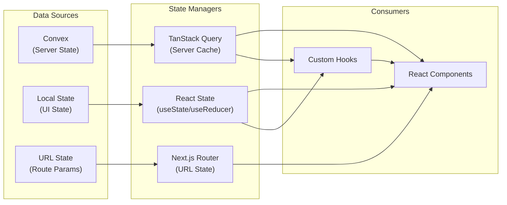
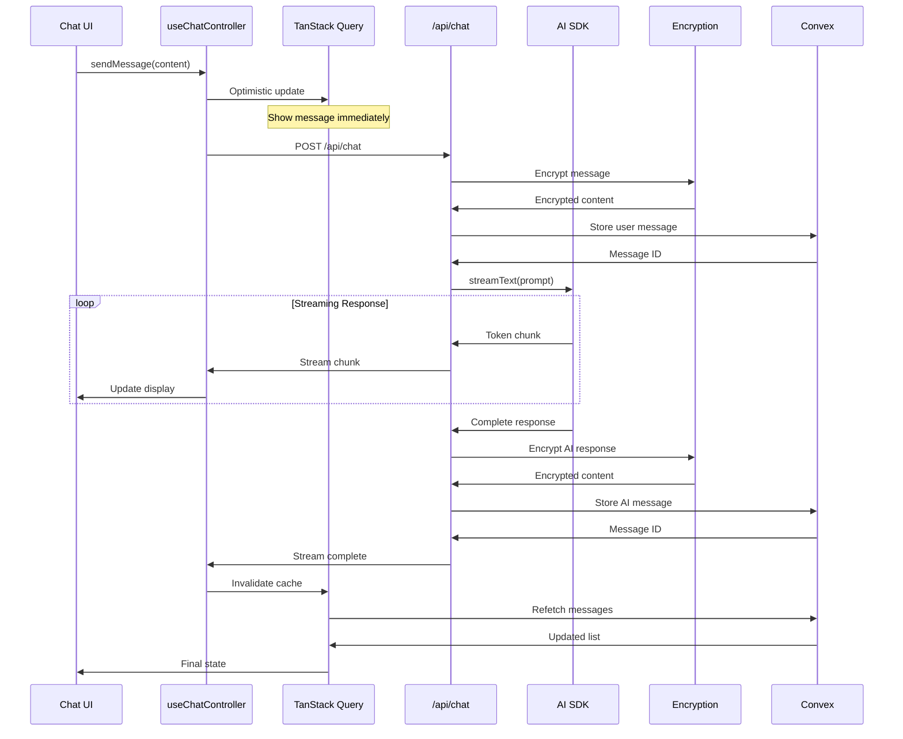
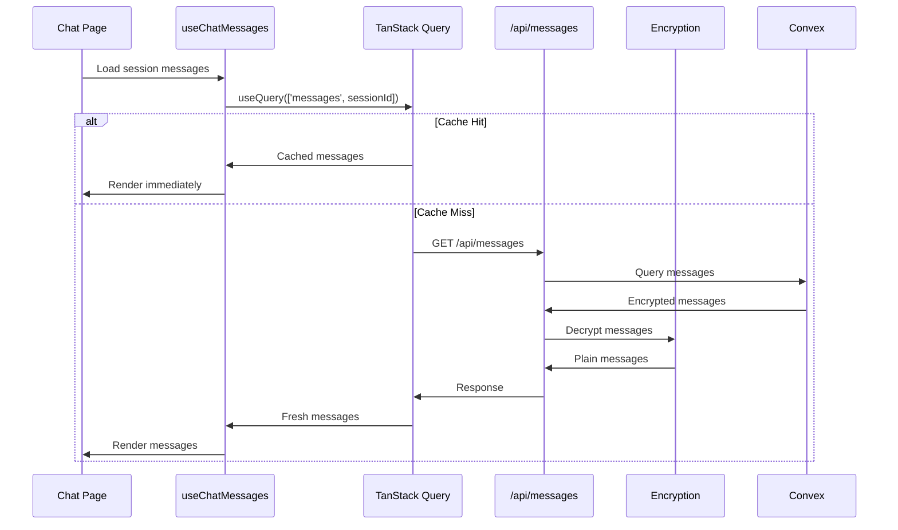
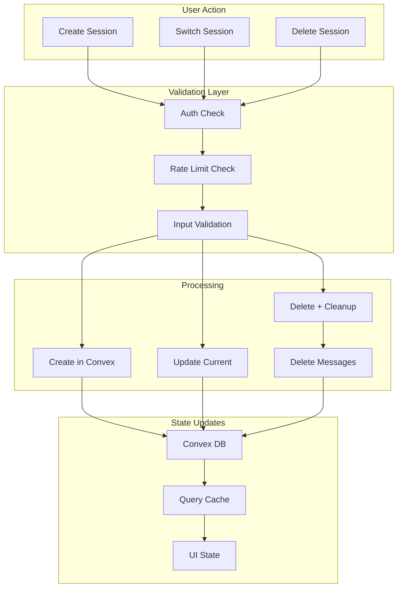
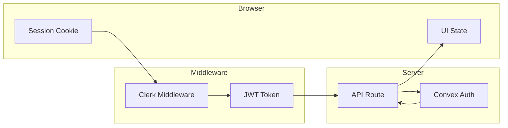
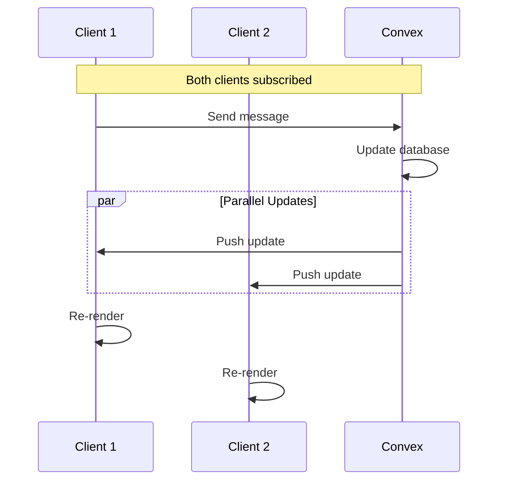
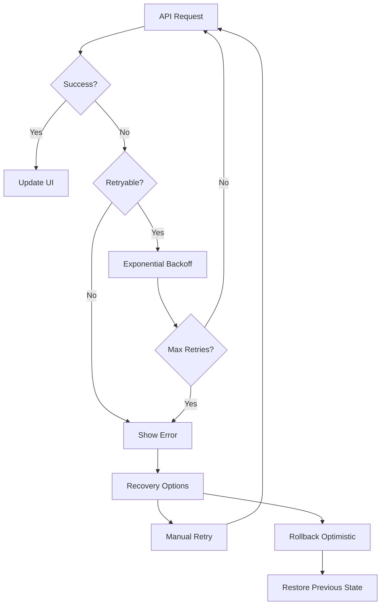
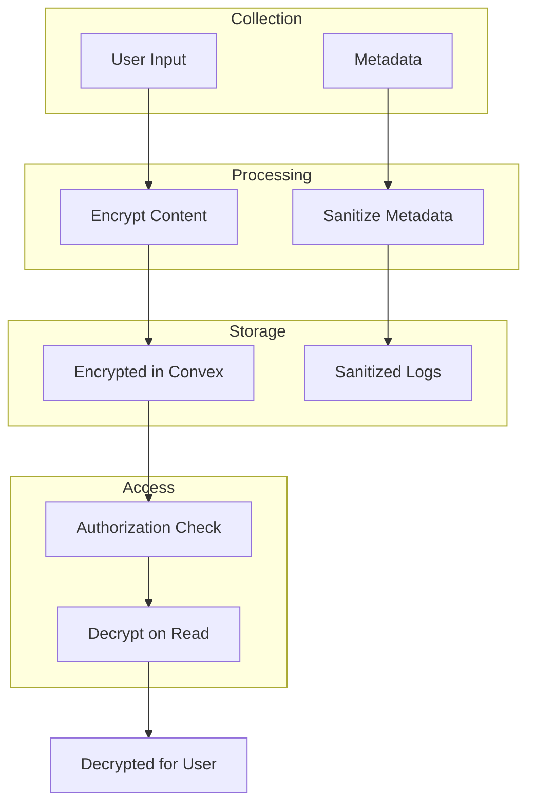

# Data Flow Architecture

This document describes how data flows through the AI Therapist application.

## State Management Overview



## Chat Message Flow

### Sending a Message



### Loading Messages



## Session Management Flow



## Authentication Data Flow



## Cache Invalidation Strategy

### Invalidation Map

| Mutation         | Invalidated Queries                    |
| ---------------- | -------------------------------------- |
| `message.send`   | `messages`, `sessions` (message count) |
| `session.create` | `sessions`                             |
| `session.delete` | `sessions`, `messages`                 |
| `session.update` | `sessions`                             |
| `user.update`    | `user`                                 |

### Implementation

```typescript
// Cache invalidation pattern
const invalidationMap = {
  'message.send': ['messages', 'sessions'],
  'session.create': ['sessions'],
  'session.delete': ['sessions', 'messages'],
  'session.update': ['sessions'],
} as const;

// After mutation
queryClient.invalidateQueries({
  queryKey: invalidationMap[mutationType],
});
```

## Real-Time Updates

### Convex Reactive Queries



### Update Flow

```typescript
// Convex reactive query subscription
const messages = useQuery(
  api.messages.list,
  { sessionId },
  {
    // Automatically re-runs when data changes
    suspense: false,
  }
);
```

## Error Recovery Flow



## Form Data Flow

```mermaid
flowchart LR
    subgraph Input
        UserInput["User Input"]
        Validation["Zod Validation"]
    end

    subgraph Transform
        Sanitize["Sanitize"]
        Transform["Transform"]
    end

    subgraph Persist
        API["API Route"]
        Convex["Convex"]
    end

    subgraph Feedback
        Success["Success Toast"]
        Error["Error Display"]
    end

    UserInput --> Validation
    Validation -->|Valid| Sanitize
    Validation -->|Invalid| Error

    Sanitize --> Transform
    Transform --> API
    API --> Convex

    Convex -->|Success| Success
    Convex -->|Error| Error
```

## Performance Optimizations

### Query Deduplication

```typescript
// Same query key = deduplicated request
const { data: session1 } = useQuery(['session', id]); // Request 1
const { data: session2 } = useQuery(['session', id]); // Deduped
```

### Optimistic Updates

```typescript
// Optimistic update pattern
const mutation = useMutation({
  mutationFn: sendMessage,
  onMutate: async (newMessage) => {
    // Cancel outgoing refetches
    await queryClient.cancelQueries(['messages']);

    // Snapshot previous value
    const previous = queryClient.getQueryData(['messages']);

    // Optimistically update
    queryClient.setQueryData(['messages'], (old) => [...old, newMessage]);

    return { previous };
  },
  onError: (err, newMessage, context) => {
    // Rollback on error
    queryClient.setQueryData(['messages'], context.previous);
  },
});
```

### Prefetching

```typescript
// Prefetch on hover/focus
const prefetchSession = (sessionId: string) => {
  queryClient.prefetchQuery({
    queryKey: ['session', sessionId],
    queryFn: () => fetchSession(sessionId),
    staleTime: 30_000, // Consider fresh for 30s
  });
};
```

## Data Privacy Flow



## Related Documentation

- [System Overview](./OVERVIEW.md)
- [Component Hierarchy](./COMPONENT-HIERARCHY.md)
- [Data Model](/docs/DATA_MODEL.md)
