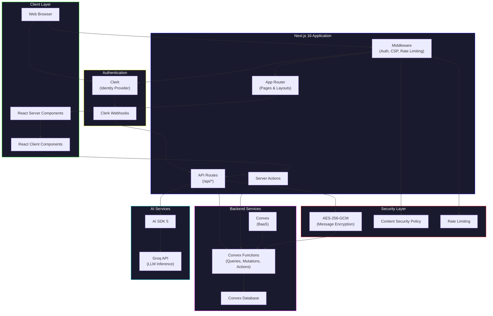
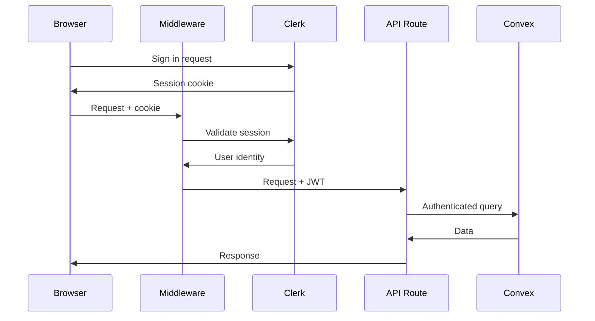
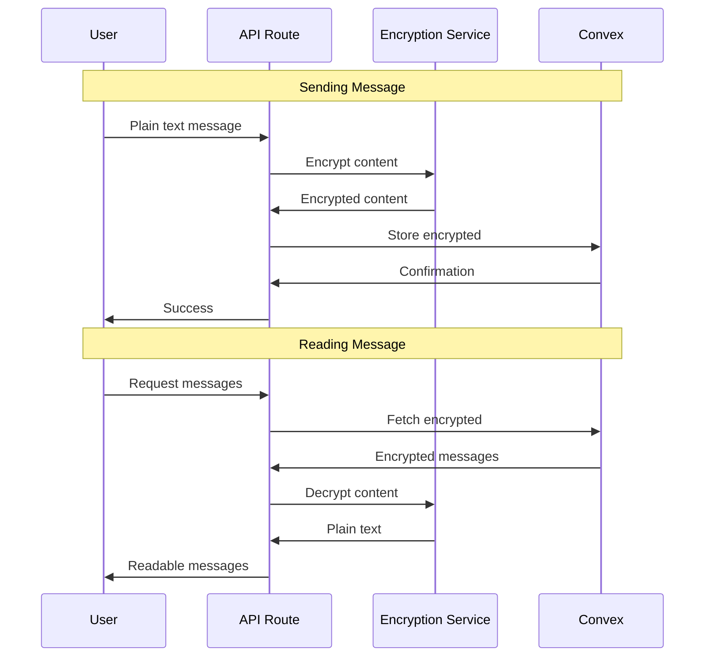

# System Architecture Overview

This document provides a high-level view of the AI Therapist application architecture.

## Architecture Diagram



## Technology Stack

### Frontend

| Technology     | Version | Purpose                           |
| -------------- | ------- | --------------------------------- |
| Next.js        | 16      | React framework with App Router   |
| React          | 19      | UI library with Server Components |
| TypeScript     | 5.6     | Type-safe JavaScript              |
| Tailwind CSS   | 4       | Utility-first CSS                 |
| TanStack Query | 5       | Server state management           |
| Radix UI       | Latest  | Accessible component primitives   |

### Backend

| Technology | Version | Purpose                     |
| ---------- | ------- | --------------------------- |
| Convex     | 1.29    | Backend-as-a-Service (BaaS) |
| Clerk      | 6.34    | Authentication & identity   |
| Zod        | 4       | Schema validation           |

### AI

| Technology | Version | Purpose                       |
| ---------- | ------- | ----------------------------- |
| AI SDK     | 5       | Unified AI provider interface |
| Groq       | Latest  | LLM inference (Llama models)  |

### Security

| Technology    | Purpose                         |
| ------------- | ------------------------------- |
| AES-256-GCM   | Field-level message encryption  |
| CSP           | Cross-site scripting prevention |
| Rate Limiting | API abuse prevention            |

## Key Architectural Patterns

### 1. Server-First Rendering

The application uses React Server Components (RSC) as the default, with client components only where interactivity is required:

```
Server Components (default)
├── Layout rendering
├── Data fetching
├── Static content
└── SEO optimization

Client Components ('use client')
├── Interactive forms
├── Real-time updates
├── Browser APIs
└── Event handlers
```

### 2. API Route Proxying

All Convex interactions go through Next.js API routes rather than direct browser access:

```
Browser → Middleware → API Route → Convex
                         ↓
                   Auth Validation
                   Rate Limiting
                   Encryption
```

This provides:

- Authentication enforcement
- Rate limiting
- Request logging
- Encryption at the API boundary

### 3. Real-Time Data Sync

Convex provides automatic real-time synchronization:

```
Convex Database
      ↓
Convex Functions (reactive queries)
      ↓
Next.js API Routes
      ↓
TanStack Query (cache invalidation)
      ↓
React Components (re-render)
```

### 4. Authentication Flow



### 5. Message Encryption Flow



## Module Boundaries

### Feature Modules

```
src/features/
├── auth/           # Authentication UI components
├── chat/           # Chat interface and messaging
│   ├── components/
│   ├── hooks/
│   └── types/
├── therapy/        # Therapeutic frameworks (CBT, Schema)
│   ├── analysis/   # Therapeutic analysis
│   ├── frameworks/ # CBT, ERP, Schema
│   └── reports/    # Session reports
├── therapy-chat/   # Therapy-specific chat features
└── shared/         # Shared utilities
```

### Library Modules

```
src/lib/
├── api/            # API clients, middleware, rate limiting
├── chat/           # Chat utilities, message handling
├── security/       # CSP, encryption
├── therapy/        # Therapeutic analysis logic
├── utils/          # General utilities
└── validation/     # Zod schemas
```

## Performance Characteristics

| Metric                   | Target  | Achieved |
| ------------------------ | ------- | -------- |
| Server render time       | < 50ms  | ~12ms    |
| Time to First Byte       | < 200ms | < 100ms  |
| Largest Contentful Paint | < 2.5s  | < 1.5s   |
| First Input Delay        | < 100ms | < 50ms   |

## Security Architecture

### Defense in Depth

```
Layer 1: Network
├── HTTPS only
├── Security headers
└── CSP enforcement

Layer 2: Application
├── Clerk authentication
├── JWT validation
└── Rate limiting

Layer 3: API
├── Input validation (Zod)
├── Output sanitization
└── Error handling

Layer 4: Data
├── Field encryption (AES-256-GCM)
├── Ownership validation
└── Audit logging
```

### Sensitive Data Handling

- **Messages**: Encrypted at rest and in transit
- **Sessions**: Server-managed via Clerk
- **API Keys**: Server-side only, never exposed to client
- **User Data**: Minimal collection, Clerk handles PII

## Scalability Considerations

### Current Architecture

- **Horizontal scaling**: Serverless functions scale automatically
- **Database**: Convex handles scaling transparently
- **Rate limiting**: Per-user, in-memory (single instance)

### Future Scaling Path

1. **Redis rate limiting**: For horizontal pod scaling
2. **Edge functions**: Deploy to edge for lower latency
3. **Database sharding**: If data volume requires

## Related Documentation

- [ADR-001: Convex Backend](/docs/adr/ADR-001-convex-backend.md)
- [ADR-002: Clerk Authentication](/docs/adr/ADR-002-clerk-authentication.md)
- [ADR-003: Component Architecture](/docs/adr/ADR-003-component-architecture.md)
- [Data Model](/docs/DATA_MODEL.md)
- [Deployment Guide](/docs/DEPLOYMENT.md)
